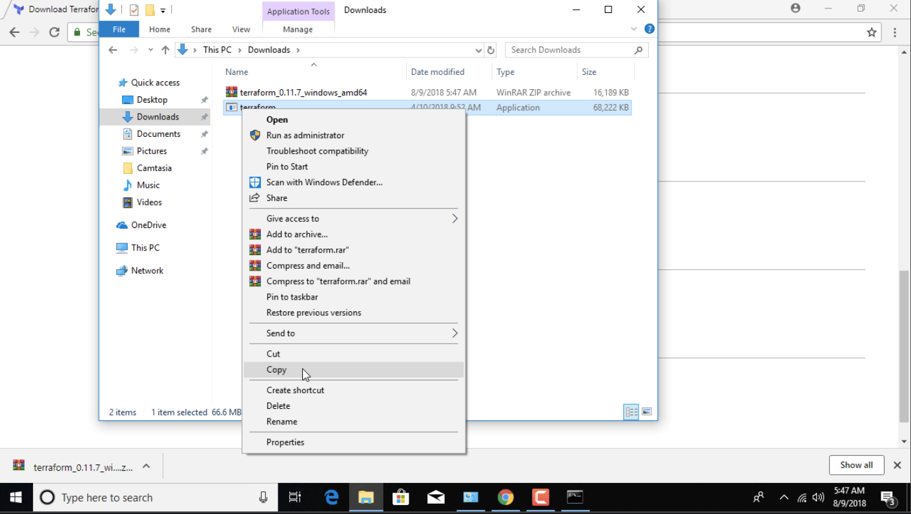
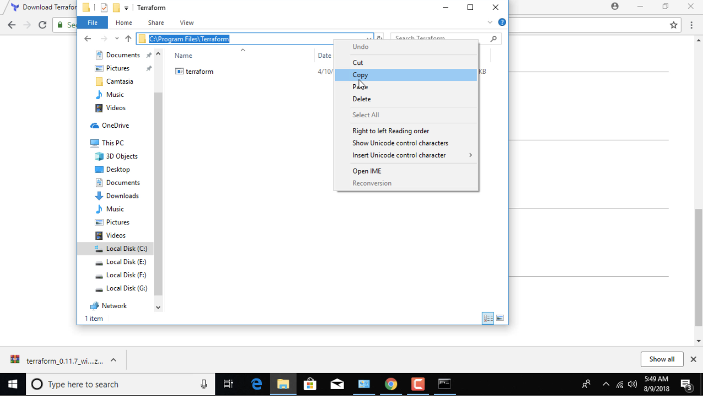
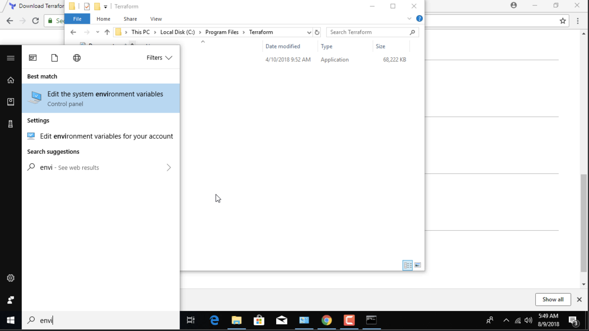
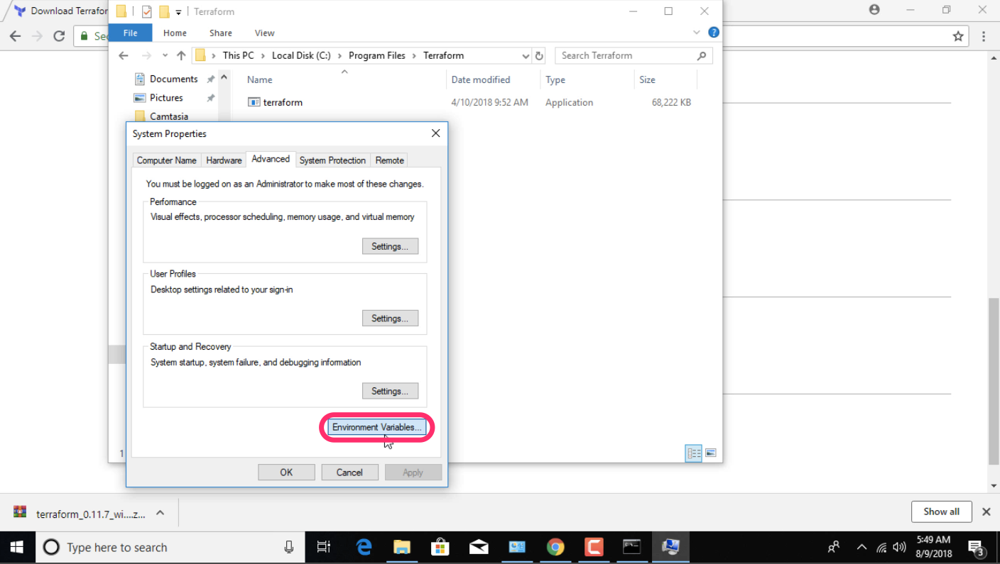
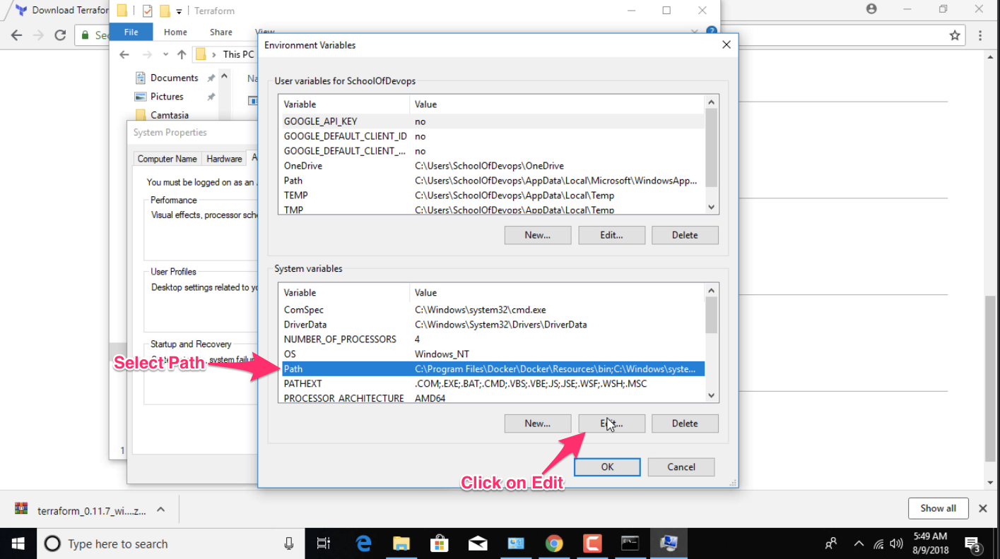

# Environement Setup


## AWS Account Setup


## Terraform Installation

### Ubuntu
Follow the following steps to install Terraform on ubuntu.

```
wget https://releases.hashicorp.com/terraform/0.11.8/terraform_0.11.8_linux_amd64.zip
unzip terraform_0.11.8_linux_amd64.zip
sudo mv terraform /usr/bin/local
sudo chmod +x /usr/bin/local/terraform
```

### Windows

Visit the following link to download the Terraform executable.

[Terraform for Windows](https://releases.hashicorp.com/terraform/0.11.8/terraform_0.11.8_windows_amd64.zip).

Extract the file.


Copy the extracted file.



Create a new directory called `Terrafrom` insice `C:\Program Files\`


Paste the file we have copied in the previous step.


Copy the file path for the executable.


Search for `environment` from your start menu.


Then select environment variables form the window.


Select Path variable and edit it.


Add the path that we have copied earlier.


### MacOS

```
wget https://releases.hashicorp.com/terraform/0.11.8/terraform_0.11.8_darwin_amd64.zip
unzip terraform_0.11.8_darwin_amd64.zip
sudo mv terraform /usr/bin/local
sudo chmod +x /usr/bin/local/terraform
```

## Validate the Installation

Open a Shell session and run `terraform -v`. This should produce the following output.

```
terraform -v

[output]
Terraform v0.11.7
```