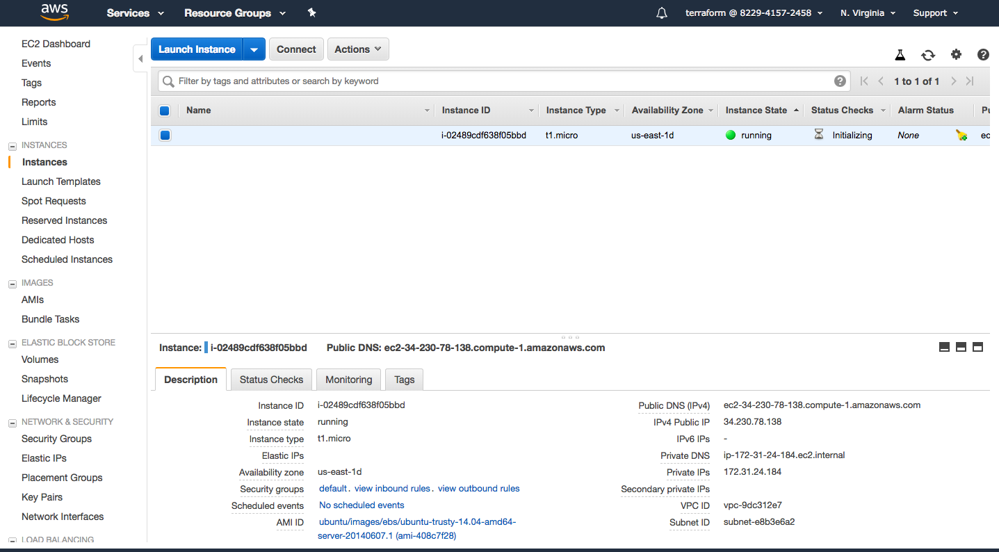

# Resources

Resources are the building block in Terraform. These the actual cloud entities that you are either creating/deleting or modifying. To do so, you will have to define them in a terraform manifest and apply them. 

## Creating our first Resource

Let us create an EC2 instance, which is going to be our first resource on AWS using Terraform. 

Every resorce has the following syntax.

`resource syntax`
```
resource "resource_type" "resource_name" {
  config1 = value1
  config2 = value2
}
```
Here, 
  resource_type = The type of the resouce that we create/delete/modfiy
  resource_name = Give the resource a name for Terraform internal references.
  config(1-n)   = The properties of the reosurce your manipulating.

In your main.tf, add this block next to your Provider definition. 

`an ec2 resource`
```
resource "aws_instance" "webserver" {
  ami           = "ami-408c7f28"
  instance_type = "t1.micro"
}
```
Here, to compare it with the syntax,
  resource_type = aws_instance
  resource_name = webserver
  config1       = ami
  value1        = ami-408c7f28(ubuntu-14.04)
  config2       = instance_type
  value2        = t1.micro

Your `main.tf` file should look like the following. 

```
provider "aws" {
  region = "us-east-1"
}

resource "aws_instance" "webserver" {
  ami           = "ami-408c7f28"
  instance_type = "t1.micro"
}
```

Then run `terraform plan` to see what will happen if we apply the manifest.

```
terraform plan

[output]
Refreshing Terraform state in-memory prior to plan...
The refreshed state will be used to calculate this plan, but will not be
persisted to local or remote state storage.


------------------------------------------------------------------------

An execution plan has been generated and is shown below.
Resource actions are indicated with the following symbols:
  + create

Terraform will perform the following actions:

  + aws_instance.webserver
      id:                           <computed>
      ami:                          "ami-408c7f28"
      arn:                          <computed>
      associate_public_ip_address:  <computed>
      availability_zone:            <computed>
      cpu_core_count:               <computed>
      cpu_threads_per_core:         <computed>
      ebs_block_device.#:           <computed>
      ephemeral_block_device.#:     <computed>
      get_password_data:            "false"
      instance_state:               <computed>
      instance_type:                "t1.micro"
[...]

Plan: 1 to add, 0 to change, 0 to destroy.

------------------------------------------------------------------------

Note: You didn't specify an "-out" parameter to save this plan, so Terraform
can't guarantee that exactly these actions will be performed if
"terraform apply" is subsequently run.
```

Then run, `terraform apply` to actually create the resource on AWS.

```
terraform apply

[output]
[...]
aws_instance.webserver: Still creating... (10s elapsed)
aws_instance.webserver: Still creating... (20s elapsed)
aws_instance.webserver: Still creating... (30s elapsed)
aws_instance.webserver: Still creating... (40s elapsed)
aws_instance.webserver: Creation complete after 49s (ID: i-02489cdf638f05bbd)

Apply complete! Resources: 1 added, 0 changed, 0 destroyed.
```

We have successfully created our first reosource on AWS. Please check your AWS console to check the properties(AMI and instance type) of the machine.


