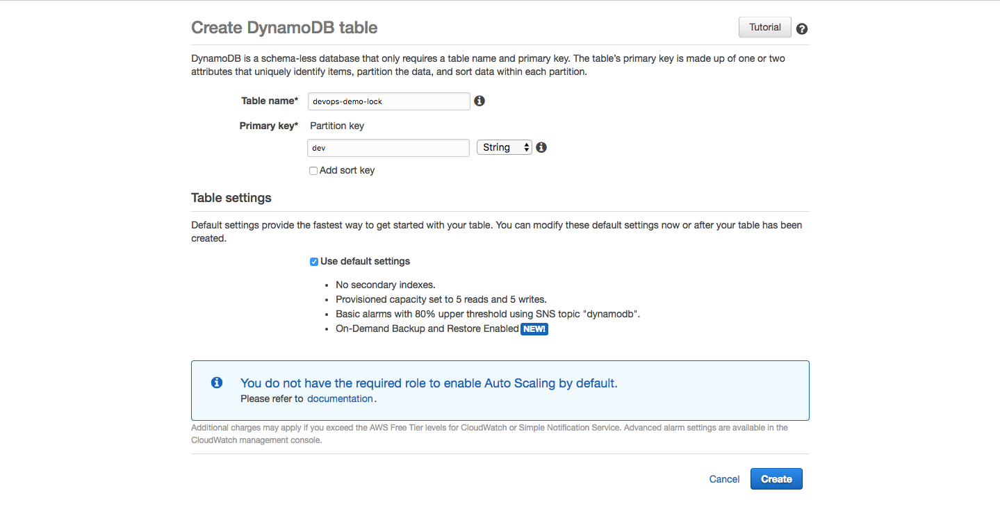

## Backends


### Create S3 Bucket

First create a S3 bucket which is going store the state file. Enable `versioning` to enable state recovery if something goes wrong.


Create a directory called `dev` in that bucket.


```
touch backend.tf
```

`file: backend.tf`
```
terraform {
  backend "s3" {
    bucket = "devopsdemo-tf-backend"
    key    = "/dev"
    region = "us-east-1"
  }
}
```

### Create DynamoDB Table for State Locking



Update our backend file accordingly.

`file: backend.tf`
```
terraform {
  backend "s3" {
    bucket         = "devopsdemo-tf-backend"
    key            = "dev"
    region         = "us-east-1"
    dynamodb_table = "devops-demo-lock"
  }
}
```

### Initialize the Backend
```
terraform init

[output]
Initializing the backend...
Do you want to copy existing state to the new backend?
  Pre-existing state was found while migrating the previous "local" backend to the
  newly configured "s3" backend. No existing state was found in the newly
  configured "s3" backend. Do you want to copy this state to the new "s3"
  backend? Enter "yes" to copy and "no" to start with an empty state.

  Enter a value: yes


Successfully configured the backend "s3"! Terraform will automatically
use this backend unless the backend configuration changes.

Initializing provider plugins...

The following providers do not have any version constraints in configuration,
so the latest version was installed.

To prevent automatic upgrades to new major versions that may contain breaking
changes, it is recommended to add version = "..." constraints to the
corresponding provider blocks in configuration, with the constraint strings
suggested below.

* provider.aws: version = "~> 1.37"

Terraform has been successfully initialized!

You may now begin working with Terraform. Try running "terraform plan" to see
any changes that are required for your infrastructure. All Terraform commands
should now work.

If you ever set or change modules or backend configuration for Terraform,
rerun this command to reinitialize your working directory. If you forget, other
commands will detect it and remind you to do so if necessary.
```